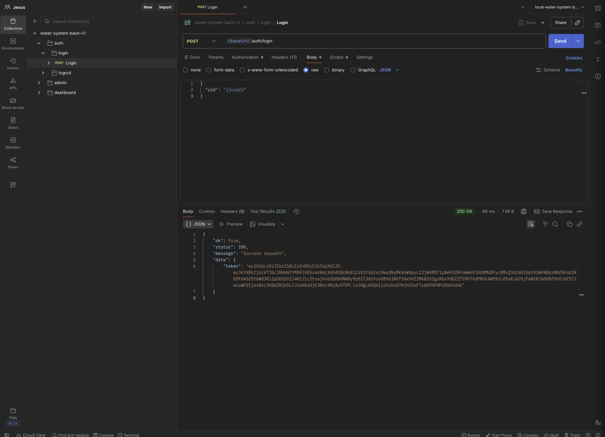
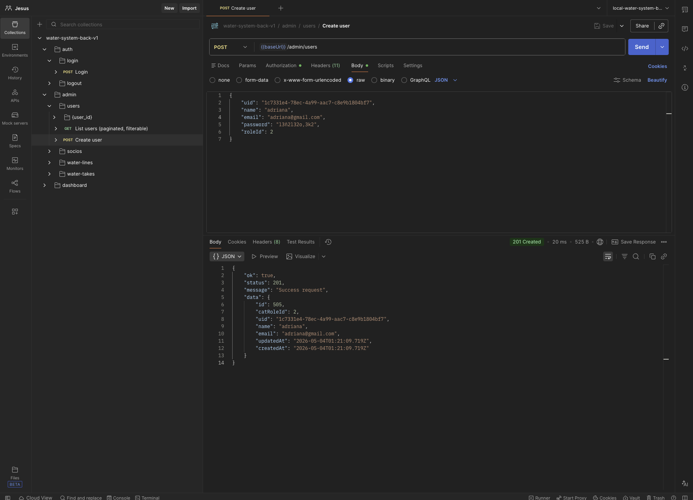

# water-system-back

## Desarrollado por: Jesus Chicho Hernandez

Este proyecto es una API backend desarrollada en Node.js que utiliza MySQL como base de datos con Sequelize como ORM. Implementa funcionalidades como autenticación segura con JWT, almacenamiento en la nube y diseñado para manejar operaciones avanzadas y eficientes en bases de datos.

### Habilidades y Características:

- **Base de datos y ORM**:
  - Experiencia con MySQL y Sequelize, optimizando consultas y relaciones complejas.

- **Autenticación y Seguridad**:
  - Implementación de autenticación basada en tokens JWT para asegurar y autorizar endpoints de manera eficiente.

- **Funcionalidades Avanzadas**:
  - Desarrollo de API RESTful con capacidades avanzadas.

- **Integración de Servicios Externos**:
  - Capacidad de integrar y optimizar servicios de almacenamiento en la nube como Firebase, AWS y otros proveedores líderes.

- **Consumo de Paquetes de Terceros**:
  - Uso experto de paquetes de terceros para mejorar la funcionalidad y escalabilidad del proyecto.

## Estructura principal del repo

```text
 ├── application
 │   └── common
 │       └── queryOptions.js
 ├── config
 │   └── config.js
 ├── database
 ├── helpers
 │   ├── response
 │   │   └── responseHelper.js
 │   ├── security
 │   │   ├── cipherHelper.js
 │   │   └── jwtHelper.js
 │   └── validation
 │       └── validateHelper.js
 ├── index.js
 ├── middlewares
 │   ├── auth
 │   │   ├── apikey.middleware.js
 │   │   └── auth.middleware.js
 │   └── errors
 │       └── 404.middleware.js
 ├── modules
 │   ├── auth
 │   │   ├── index.js
 │   │   └── v1
 │   │       ├── domain
 │   │       │   ├── authcases
 │   │       │   │   └── AuthenticateUserUseCase.js
 │   │       │   ├── entities
 │   │       │   │   └── User.js
 │   │       │   └── repositories
 │   │       │       └── UserRepository.js
 │   │       ├── index.js
 │   │       ├── infraestructure
 │   │       │   ├── data
 │   │       │   │   └── UserRepositoryImpl.js
 │   │       │   └── routes
 │   │       │       └── auth
 │   │       │           └── auth.router.js
 │   │       └── interfaces
 │   │           └── controllers
 │   │               └── AuthController.js
 │   ├── dependent
 │   │   ├── index.js
 │   │   └── v1
 │   │       ├── domain
 │   │       │   ├── dependents-cases
 │   │       │   ├── entities
 │   │       │   │   └── dependent-entity.js
 │   │       │   └── repositories
 │   │       │       ├── dependent-repository.js
 │   │       │       └── socio-repository.js
 │   │       ├── index.js
 │   │       ├── infraestructure
 │   │       │   ├── data
 │   │       │   │   ├── dependent-repository-impl.js
 │   │       │   │   └── socio-repository-impl.js
 │   │       │   └── routes
 │   │       │       └── dependent-router.js
 │   │       └── interfaces
 │   │           └── controllers
 │   │               └── dependent-controller.js
 │   ├── routes
 │   │   ├── routes.js
 │   │   └── v1
 │   │       └── index.router.js
 │   ├── socios
 │   │   ├── index.js
 │   │   └── v1
 │   │       ├── domain
 │   │       │   ├── entities
 │   │       │   │   └── Socio.js
 │   │       │   ├── repositories
 │   │       │   │   ├── AdressRepository.js
 │   │       │   │   ├── ProfileRepository.js
 │   │       │   │   └── SocioRepository.js
 │   │       │   └── socioscases
 │   │       ├── index.js
 │   │       ├── infraestructure
 │   │       │   ├── data
 │   │       │   │   ├── AdressRepositryImpl.js
 │   │       │   │   ├── ProfileRepositoryImpl.js
 │   │       │   │   └── SocioRepositoryImpl.js
 │   │       │   └── routes
 │   │       │       └── Socio.router.js
 │   │       └── interfaces
 │   │           └── controllers
 │   │               └── SocioController.js
 │   ├── users
 │   │   ├── index.js
 │   │   └── v1
 │   │       ├── domain
 │   │       │   ├── entities
 │   │       │   │   └── User.js
 │   │       │   ├── repositories
 │   │       │   │   └── UserRepository.js
 │   │       │   └── usercases
 │   │       ├── index.js
 │   │       ├── infraestructure
 │   │       │   ├── data
 │   │       │   │   └── UserRepositoryImpl.js
 │   │       │   └── routes
 │   │       │       └── User.router.js
 │   │       └── interfaces
 │   │           └── controllers
 │   │               └── UserController.js
 │   ├── water-lines
 │   │   ├── index.js
 │   │   └── v1
 │   │       ├── domain
 │   │       │   ├── entities
 │   │       │   │   └── water-line.js
 │   │       │   ├── repositories
 │   │       │   │   └── WaterLinesRepository.js
 │   │       │   └── water-lines-cases
 │   │       ├── index.js
 │   │       ├── infraestructure
 │   │       │   ├── data
 │   │       │   │   └── WaterlinesRepositoryImpl.js
 │   │       │   └── routes
 │   │       │       └── WaterLines.router.js
 │   │       └── interfaces
 │   │           └── controllers
 │   │               └── water-linescontroller.js
 │   └── water-take
 │       ├── index.js
 │       └── v1
 │           ├── domain
 │           │   ├── entities
 │           │   │   └── water-take-entity.js
 │           │   ├── repositories
 │           │   │   └── water-take-repository.js
 │           │   └── water-takes-cases
 │           │       ├── AssignWaterLineUseCase.js
 │           │       ├── DeactivateWaterTakeUseCase.js
 │           │       ├── RestoreWaterTakeUseCase.js
 │           │       └── water-take-use-case.js
 │           ├── index.js
 │           ├── infraestructure
 │           │   ├── data
 │           │   │   └── water-take-repository-impl.js
 │           │   └── routes
 │           │       └── water-take-router.js
 │           └── interfaces
 │               └── controllers
 │                   └── water-take-controller.js
 ├── request
 ├── services
 │   ├── internal
 │   │   └── auth.service.js
 │   └── server.js
 └── utils
     └── timeUtil.js

```


### Instrucciones de inicio:

1. **Requisitos previos:**
   - Asegúrate de tener Node.js y Yarn instalados.
   - Configura MySQL y ajusta las credenciales en un archivo `.env` basado en `.env.example`.

2. **Configuración del proyecto:**
   ```bash
   # Clona el repositorio
   git clone https://github.com/JesusLBS/water-system-back.git
   cd water-system-back

   # Instala las dependencias
   yarn install

## Documentación técnica

Este proyecto incluye documentación sobre decisiones técnicas y refactors relevantes
realizados durante su evolución.

- [Refactor módulo Users](./docs/refactors/users-module.md)

## API Endpoints (ejemplos)

### Auth - Login

POST /wsb/api/v1/auth/login

Autentica un usuario y retorna un JWT.

**Request:**
```json
{
  "uid": "{{uid}}"
}
```
**Response:**
```json
{
  "ok": true,
  "status": 200,
  "message": "Success request",
  "data": {
      "token": ""
  }
}
```
### Login


### User - Crear user

POST /wsb/api/v1/admin/users

Crea un nuevo user en el sistema.

**Request:**
```json
{
  "uid": "1c7331e4-78ec-4a99-aac7-c8e9b1804bf7",
  "name": "adriana",
  "email": "adriana@gmail.com",
  "password": "l3ñ2l32o,3k2",
  "roleId": 2
}
```

**Response:**
```json
{
  "ok": true,
  "status": 201,
  "message": "Success request",
  "data": {
      "id": 507,
      "catRoleId": 2,
      "uid": "1c7331e4-78ec-4a99-aac7-c8e9b1804bf7",
      "name": "adriana",
      "email": "adriana@gmail.com",
      "updatedAt": "2026-05-04T01:26:14.631Z",
      "createdAt": "2026-05-04T01:26:14.631Z"
  }
}
```

 


### Licencia

Este proyecto no está licenciado para uso público. Todos los derechos reservados. Para obtener permisos de uso, contacta al propietario del proyecto en chichohdzjesus@gmail.com.

Consulta la licencia completa en [NOTICE.txt](./NOTICE.txt).
